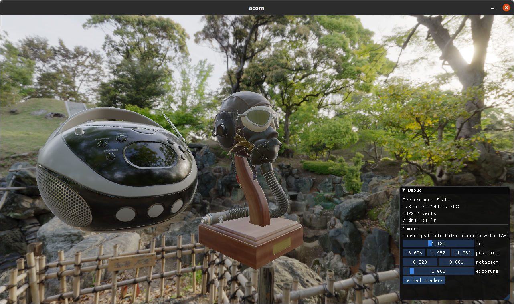

# acorn

PBR renderer and game engine

## Latest Screenshot

# References

- [Karis, Real Shading in Unreal Engine 4, 2013](https://blog.selfshadow.com/publications/s2013-shading-course/karis/s2013_pbs_epic_notes_v2.pdf)

- [Neubelt, Pettineo, Crafting a Next-Gen Material Pipeline for The Order: 1886, 2013](https://blog.selfshadow.com/publications/s2013-shading-course/rad/s2013_pbs_rad_notes.pdf)

- [Lagarde, Moving Frostbite to PBR, 2014](https://blog.selfshadow.com/publications/s2014-shading-course/frostbite/s2014_pbs_frostbite_slides.pdf)

- [Elek, Rendering Parameterizable Planetary Atmospheres with Multiple Scattering in Real-Time, 2009](https://old.cescg.org/CESCG-2009/papers/PragueCUNI-Elek-Oskar09.pdf)

- [Hillaire, Physically Based Sky, Atmosphere and Cloud Rendering in Frostbite, 2016](https://media.contentapi.ea.com/content/dam/eacom/frostbite/files/s2016-pbs-frostbite-sky-clouds-new.pdf)
